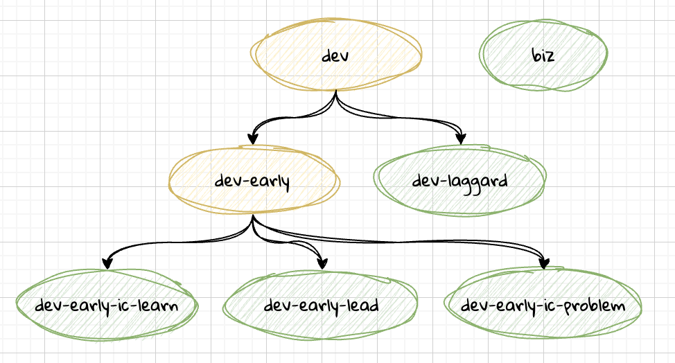
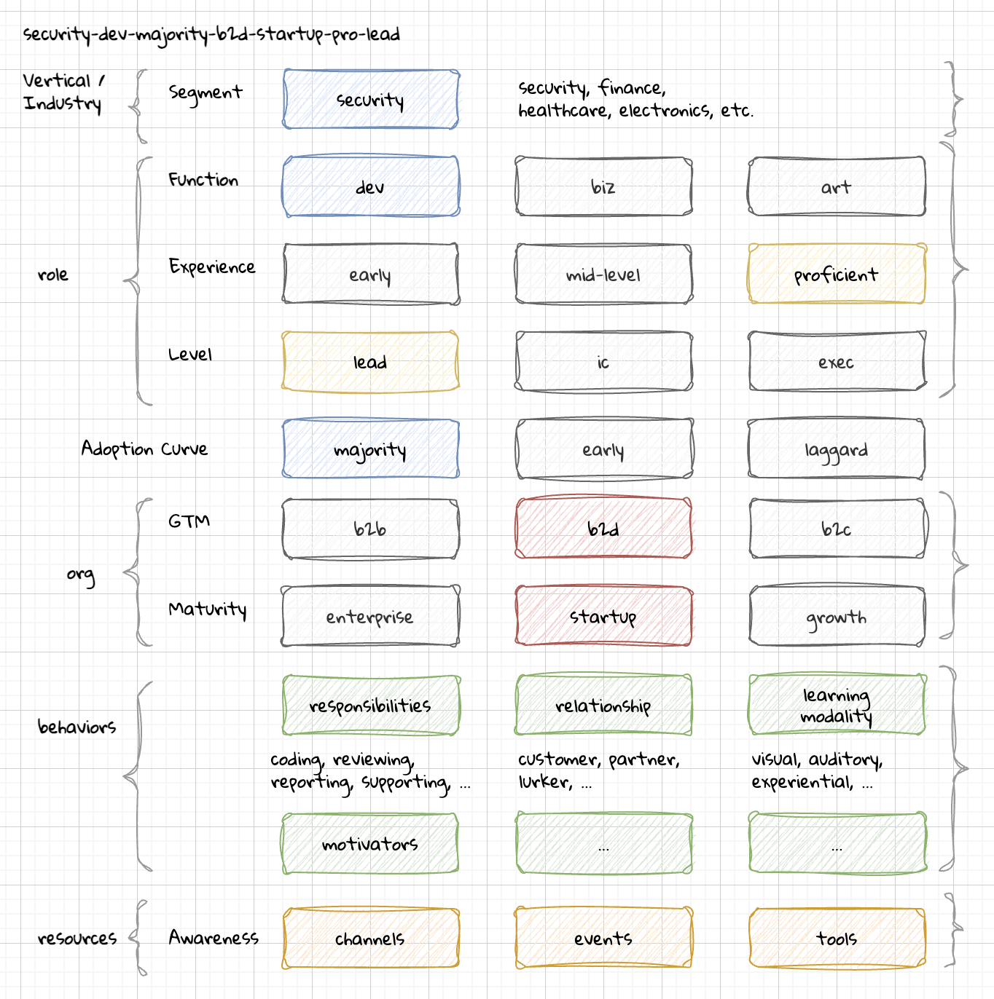

# DevRel Foundation Persona Library System (DEVREL-PLS)

## INTRODUCTION

The **DevRel Foundation Persona Library System (DEVREL-PLS)** is built to help organizations of all shapes and sizes be more effective with personas for software products. A persona is often used cross-functionally in user-experience, marketing, sales, and other disciplines to define semi-fictitious representations of a person who is the target buyer or user of a product or service.

Developer Relations is often called upon to help define the persona for a software developer.

### Problem

Many persona creation efforts fall short and don't deliver lasting value to organizations beyond an initial alignment with a few representatives of different functions. The misalignment has lasting friction across the organization.

This system is designed to address some of those difficulties where personas are created that are too generic, too specific, too bespoke, too complicated to use, and too difficult to find real world examples.

### Benefits

The DEVREL-PLS has a number of benefits that come from using this in your own organization:

- good starting point to quickly launch a persona development effort (general library)
- resources that help you and your team built from industry collaboration (governance)
- cross-organizational consistency when changing roles or companies (open-source)
- quick ramp for individuals who are performing a devrel function even when not having a devrel role with a deep understanding of developer communities (training guides and docs)
- facilitate conversations with third-party agencies to reference personas from the general collection that match your target customer profile (public)

## CORE CONCEPTS

There are a few core concepts or big ideas that differentiate the DevRel Foundation Persona Library System from other persona approaches.

### Key Traits

Personality assessments use a series of questions to categorize an individual's profile into buckets. Using this shorthand notation, it is easy to share heuristics about how to understand or work effectively with somebody based on a commonly shared identifier.

- An _INTJ_ in the Myers Briggs Type Indicator (MBTI) system
- A _Restorative, Analytical, Achiever_ in the Gallup CliftonStrengths
- A _Type 9 Peacemaker_ in the Enneagram System (RHETI)

The DEVREL-PLS similarly models personas after mutually exclusive deterministic traits. That means you can refer to a persona by a type and somebody who works at a different company who is familiar with the DEVREL-PLS will understand.

#### Example 

**mix-early-b2d-startup-mid-lead-infl**
- mixed function persona
- early adopter of new technology or products
- developer-first startup
- mid-career progression
- team leader
- influencer type who works in the broader community

Sounds like a Lead Developer Advocate role.

### Structured Syntax

The DEVREL-PLS is a schema rather than a template-based system for defining personas. By using JSON as the syntax, the persona is something that can be operated on. Inherit from other personas, merge, split, validate, format, exchange, transform, load into visualization and tracking tools.

A **dev** has key-value pairs that identify the persona traits:
```json
{
    ...,
    "role": {
        "function": "dev",
        "responsibilities": ["coding", ...],
        "titles": ["Software Engineer", ...],
        "tools": ["drf-ide", "drf-scm", ...]
    },
    ...
}
```

When defining personas for an organization, you only need to take and extend the leaf nodes that represent a significant branch along a trait relevant for your organization.



Different industry / vertical segments will have their own variations from these root functional personas.

A **security-dev**:
```json
{
    ...
    "role": {
        "titles": ["AppSec Engineer"],
        ...
    },
    "awareness": [
        "channels": [
            {"format": "newsletter", "url": "https://tldrsec.com"}
        ],
        "events": ["drf-bsidessf.org", "drf-blackhat.com"]
    ],
    ...
}
```

The `drf-` prefix indicates that these correspond to other DevRel Foundation Resource projects like the [Tools Catalog](https://github.com/DevRel-Foundation/Tools-Catalog) and [Events Directory](https://github.com/DevRel-Foundation/Events-Directory).

Another advantage of structured syntax is tooling:

```json
$ pls-validate --data dev.json

$ pls-json-to-md security-dev.json > dev-persona.md
```

More ease of use tools such as user interfaces can be developed for filtered views for task-specific objectives, contribution validation, and direct integrations to tools like Salesforce, Common Room, AirTable, Asana can all benefit.

### Usage Guides

As difficult as it can be to define personas well, it is even more difficult to find ways of using them in operational day-to-day work.

DEVREL-PLS has identified tutorials and guides to emphasize how to use personas for DevRel programs rather than simply creating them. 

See the [README](../../README.md) for links to other guides.

## MAKING PERSONAS

You will want to start with a **Persona Set**, a small collection of personas from the general collection that you customize and extend for your organizational needs. 

### 1. Identify Key Traits

The trait-based framework identifies traits that matter most to an organization. You may not use all of the traits, but effectively you are selecting a combination of traits that express what makes the persona differentiated.



Traits act like a typing system and should be deterministic and mutually exclusive. The key trait triple to begin your persona set would likely include:
- [Segment](../traits/segment.md)
- [Function](../traits/role-function.md)
- [Adoption Curve](../traits/adoption-curve.md)

You can substitute other traits, but this is a good place to start. Pick the closest match from the general collection to begin customization.

### 2. Branch Traits

You need to identify the dimensions that you would most often use to differentiate between your key user or customer cases.

- separate buyers and users by [function](../traits/role-function.md) (dev or biz)
- separate decision-makers along [role level](../traits/role-level.md) (ic or lead)

Review the [organization](../traits/organization.md) and [role](../traits/role.md) traits that make sense for your needs. Start small, and only as you realize you need better targeting would you revisit and fork.

### 3. Fill in Attributes

The traits that have been defined help differentiate, but there are also attributes you use to flush out the tendencies.

This includes [motivations](../traits/motivations.md) and tendencies around things like [adoption](../traits/adoption.md). You may find the general collection and other persona sets have something that identifies a good baseline for these motivations and strategies to reach the persona.

### 4. Map Product Constraints

Some attributes such as [technologies](../traits/role-technologies.md) dive into details about the role. These are useful to consider because it helps with excluding personas that are a bad fit.

### 5. Add Storytelling Attributes

These wouldn't be required, but is how you would add a personal touch similar to other traditional persona systems.
* `label`
* `narrative`

Some may prefer to reference _Bert the Buildmeister_ but if the creativity gets in the way of functionality you may also refer to personas by id: _devops-mix-b2d-laggard_ because then anybody can look the persona up in the library to get a broader picture of the profile.

### 6. Share

Don't share any confidential information or trade secrets, but if there are details about the personas you've created with this system that may help others, contribute those details back to the general collection.

This helps you in providing documentation and training for new members of your team all in one place rather than specific customizations you've utilized through forking the project.


