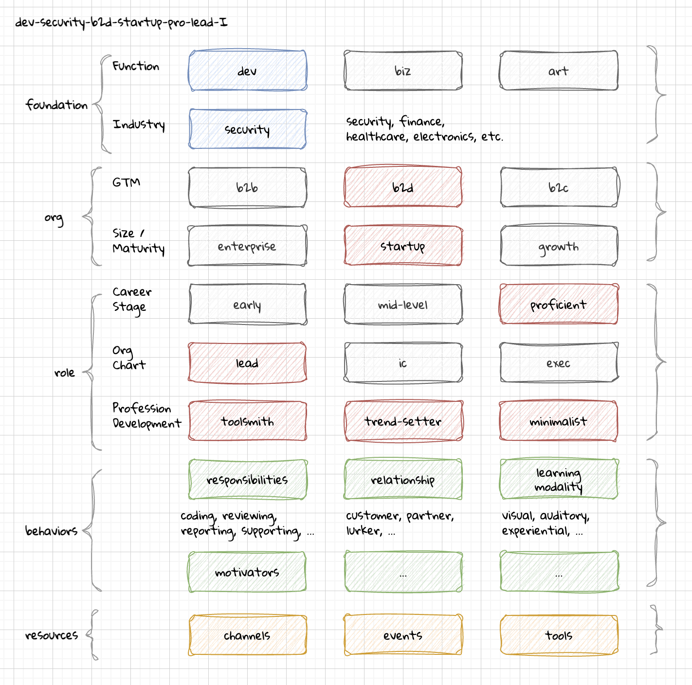

# DevRel Foundation Persona System (DRF-PS)

The **DevRel Foundation Persona System (DRF-PS)** aims to standardize how personas can be defined for use in programs. It is a trait-based framework where personas are defined by the traits that matter most to an organization. The definition is effectively a matrix of these attributes to flush out a persona definition. When building out personas, it is like a rubix cube of picking as many colors to line up as is needed to form the identifying characteristics to accomplish a task.


### Traits

Documentation explaining the various attributes that form a Persona.

- [Organization Traits](./docs/traits/organization.md)
- [Role Traits](./docs/traits/role.md)
- [Professional Development Traits](./docs/traits/learning.md)

### Indexes

Mapping documenation to cross-reference personas.

- Job Title Index (_TODO_)
- Industry Index (_TODO_)


## BENEFITS

### Quickly transfer experience to new contributors.

### Consistency when changing companies and roles.

### Facilitates working with third-party agencies.

### Efficient collaboration with other roles and teams.


## HOW-IT WORKS



### Attributes

### Data

### Persona Sets


## TRAITS


### Labeling

Unique to your organization, a label that is easy to remember or has a clever alliteration is a common pattern. Underlying this label however is an identifier that speaks to the set of attributes and traits that really define the persona to help make strategic decisions.

### Identifier

#### Naming Convention

The naming convention for the identifier is kebab-case in lowercase letters.

```
{function}-{industry}-{gtm}-{org maturity}-{career stage}-{org chart}-{prof. dev}
```

#### `I`

Substitute `I` as the identity matrix for all variations of a trait. The number identifier indicates how many consecutive traits.

```
I-security-5I                   # all security personas
dev-security-5I                 # all security developers
biz-security-b2b-2I-pro-I       # security business roles, both Leads & ICs
```


## DESIGN

### Why JSON?


